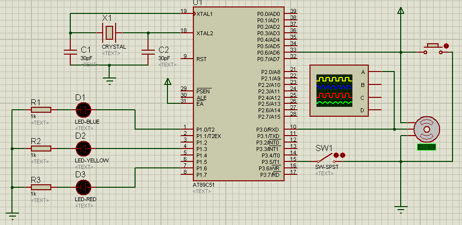

# UnlockByKnockC51
A MCU program written in keil C51, unlock/turning the step motor with knock frequency

## Require Unit
| Unit             | Model         |
| ---------------- | ------------- |
| MCU              |  STC12C5A60S2 |
| Vibration Sensor |  SW18010P     |
| Step Motor       |  *            |

## Schematics

### main

### vibration sensor
